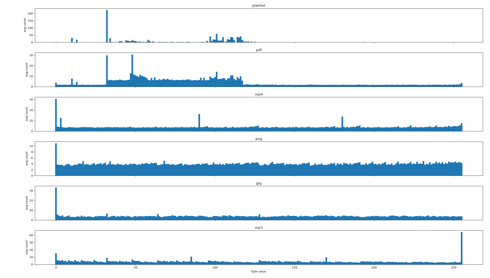
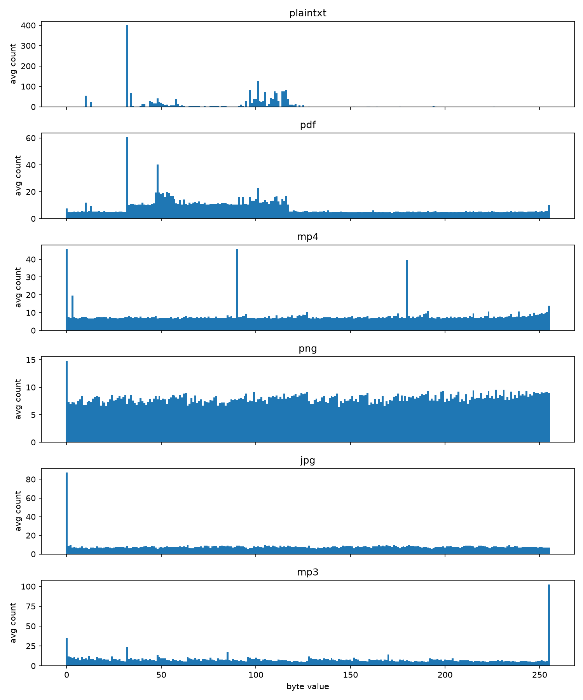

### wtf's machine learning stuffs

```bash
uv pip install -r requirements.txt
```

dataset directory `ml/dataset`
(not pushing this, way too many files)
```
dataset
├── csv
├── jpg
├── pdf
├── plaintxt
└── png
└── ...etc
```

generate `dataset.csv`:
```
python generate_dataset.py
```
picks a random offset, , reads 1024 bytes, creates a histogram, stores it.

Each dataset row consists of:

`[byte0, byte1, ..byte255, label]`

Example: `137,80,78,71,...,png` or
`255,216,255,...,jpg`

train random forest model:
```
python train_random_forest.py
```

creates `model.joblib`.

test:
```
python random_forest.py <yourfile>
```

### latest classification report: 
Window size: 1024 bytes 
#### ~82% accuracy
```
['jpg' 'mp3' 'mp4' 'pdf' 'plaintxt' 'png']
              precision    recall  f1-score   support

         jpg       0.74      0.82      0.78       207
         mp3       0.87      0.94      0.91       208
         mp4       0.71      0.83      0.77       186
         pdf       0.99      0.63      0.77       202
    plaintxt       0.99      1.00      1.00       214
         png       0.68      0.69      0.68       183

    accuracy                           0.82      1200
   macro avg       0.83      0.82      0.82      1200
weighted avg       0.84      0.82      0.82      1200
```



Window size: 2048 bytes
#### ~87% accuracy
```
['jpg' 'mp3' 'mp4' 'pdf' 'plaintxt' 'png']
              precision    recall  f1-score   support

         jpg       0.88      0.89      0.88       207
         mp3       0.90      1.00      0.95       208
         mp4       0.72      0.86      0.78       186
         pdf       0.99      0.64      0.78       202
    plaintxt       1.00      1.00      1.00       214
         png       0.79      0.84      0.81       183

    accuracy                           0.87      1200
   macro avg       0.88      0.87      0.87      1200
weighted avg       0.89      0.87      0.87      1200
```
