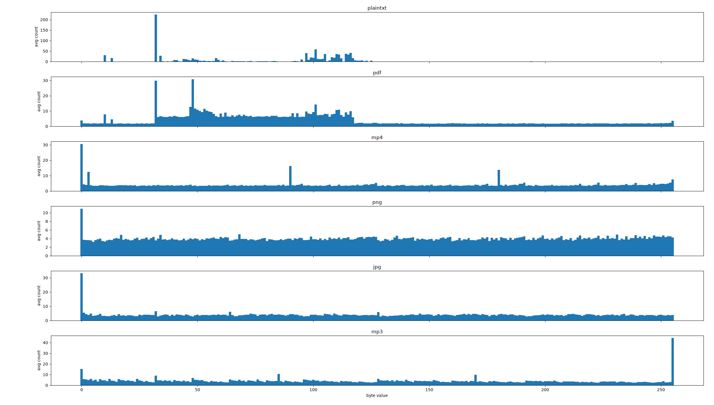

### wtf's machine learning stuffs

```bash
uv pip install -r requirements.txt
```

dataset directory `ml/dataset`

```
dataset
├── csv
├── jpg
├── pdf
├── plaintxt
└── png
└── ...etc
```

generate `dataset.csv`:
```
python generate_dataset.py
```

train random forest:
```
python train_random_forest.py
```

creates `model.joblib`.

test:
```
python random_forest.py <yourfile>
```

### latest classification report: 

#### ~85% accuracy
```
['jpg' 'mp3' 'mp4' 'pdf' 'plaintxt' 'png']
              precision    recall  f1-score   support

         jpg       0.84      0.86      0.85      1000
         mp3       0.59      0.93      0.72       112
         mp4       0.62      0.84      0.71       414
         pdf       1.00      0.80      0.89      1000
    plaintxt       0.99      1.00      1.00       614
         png       0.82      0.77      0.79      1000

    accuracy                           0.85      4140
   macro avg       0.81      0.87      0.83      4140
weighted avg       0.86      0.85      0.85      4140
```
